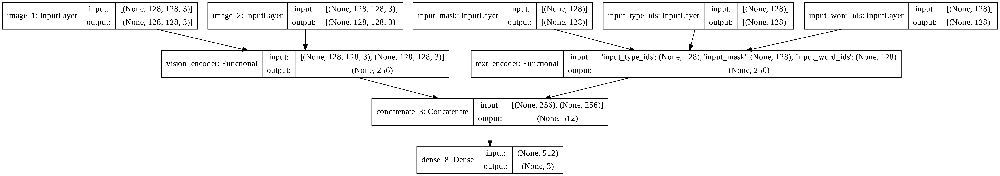

# Multimodal-Entailment-Baseline
This repository shows how to implement baseline models for [multimodal entailment](https://multimodal-entailment.github.io/). One
of these models looks like so:

High-resolution version is available [here](https://github.com/sayakpaul/Multimodal-Entailment-Baseline/blob/main/figures/model_architecture.png).

These models use the multimodal entailment dataset introduced [here](https://multimodal-entailment.github.io/). This repository
is best followed along with this blog post on keras.io: [Multimodal entailment](https://keras.io/examples/nlp/multimodal_entailment/). The
blog post goes over additional details, thought experiments, notes, etc.

### A fun fact

The accompanying blog post [marks](https://github.com/keras-team/keras-io/pull/581#issuecomment-899003346) the 100th example on keras.io.

## About the notebooks

* `Multimodal entailment.ipynb`: Shows how to train the model shown in above figure. 
* `multimodal_entailment_attn.ipynb`: Shows how to train a similar model with cross-attention (Luong style).
* `text_entailment.ipynb`: Uses only text inputs to train a BERT-based model for the enatailment problem.

## Acknowledgements

Thanks to the [ML-GDE program](https://developers.google.com/programs/experts/) for providing GCP credits.

Thanks to [Nilabhra Roy Chowdhury](https://de.linkedin.com/in/nilabhraroychowdhury) who worked on preparing the image data.
